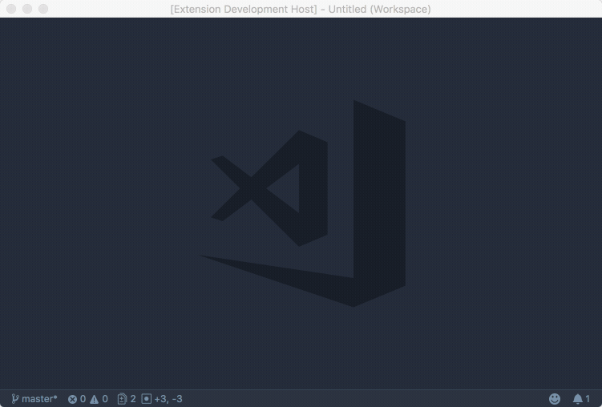

# SPFlash

 

**SPFlash** is an extension for [Visual Studio Code](https://code.visualstudio.com/) that provides templates and snippets for common front-end template assets in the classic SharePoint experience such as master pages, publishing page layouts, web parts, and more. The extension is designed for use in SharePoint 2013, SharePoint 2016, and SharePoint Online/Office 365. Many snippets and templates may also work in SharePoint 2010.

## Installation

You can find SPFlash on the [Visual Studio Code Marketplace](https://marketplace.visualstudio.com/items?itemName=spiritous.spflash). Quickly install the extension from the marketplace within Code, itself. For more information, see the official [extension documentation here](https://code.visualstudio.com/docs/editor/extension-gallery).

## File Templates

Quickly create new master pages, page layouts, and web parts for the classic SharePoint experience using `spflash.make` commands. Open the [command palette](https://code.visualstudio.com/docs/getstarted/userinterface#_command-palette) (⇧⌘P) and search for `SPFlash` to begin.

### Commands

* **SPFlash: Make Master Page** (`spflash.makeMaster`): Create a new master page file. If a workspace is currently open, SPFlash will attempt to create the new file in a [preferred directory](#extension-settings).
* **SPFlash: Make Page Layout** (`spflash.makeLayout`): Create a new publishing page layout file. If a workspace is currently open, SPFlash will attempt to create the new file in a [preferred directory](#extension-settings).
* **SPFlash: Make Web Part** (`spflash.makeWebpart`): Create a new Content Editor web part file. If a workspace is currently open, SPFlash will attempt to create the new file in a [preferred directory](#extension-settings).

## Snippets

Quickly add web controls and content fields to your templates using dozens of snippets. The language setting for the currently open file must be [`html`](https://code.visualstudio.com/docs/languages/html) or [`csharp`](https://code.visualstudio.com/docs/languages/csharp) in order for snippets to appear.

### Field Snippets

Use field snippets to create field web controls that allow rendering and editing of site columns within a page layout.

* `sp-field-text`: Single line of text
* `sp-field-multi-text`: Multiple lines of text
* `sp-field-choice`: Choice (menu to choose from)
* `sp-field-number`: Number (1, 1.0, 100)
* `sp-field-currency`: Currency ($, ¥, €)
* `sp-field-date-time`: Date and Time
* `sp-field-lookup`: Lookup (information already on this site)
* `sp-field-boolean`: Yes/No (check box)
* `sp-field-user`: Person or Group
* `sp-field-url`: Hyperlink or Picture
* `sp-field-calculated`: Calculated (calculation based on other columns)
* `sp-field-task-outcome`: Task Outcome
* `sp-field-html`: Full HTML content with formatting and constraints for publishing
* `sp-field-image`: Image with formatting and constraints for publishing
* `sp-field-link`: Hyperlink with formatting and constraints for publishing
* `sp-field-summary-links`: Summary Links data
* `sp-field-media`: Rich media data for publishing
* `sp-field-taxonomy`: Managed Metadata

### Control Snippets

Use control snippets to create SharePoint web controls that add various features and functionality to both master pages and page layouts.

* `sp-placeholder`: Add a placeholder to a master page
* `sp-field-value`: Display the value of a field/column (not editable when in edit mode)
* `sp-content`: Add a placeholder reference to a page layout
* `sp-zone`: Add a web part zone to a page layout
* `sp-edit-panel`: Add an edit mode panel, whose contents appear only in edit mode
* `sp-css`: Add a CSS file registration
* `sp-script`: Add a JavaScript file registration
* `sp-link`: Add a site- or web-relative hyperlink
* `sp-img`: Add a site- or web-relative image
* `sp-prop`: Add a project property control
* `sp-breadcrumb`: Add a breadcrumb control
* `sp-nav-global`: Add a global navigation menu control
* `sp-nav-current`: Add a current navigation menu control
* `sp-search`: Add a search box
* `sp-security`: Add a security trimmed control

### Namespace Registration Snippets

The following controls generate `<%@ Register %>` tags for use in master page and page layout files. Some of the above snippets may require that namespaces be registered in each file where they are used, if not already registered.

* `sp-register-csharp`: Add required language registration for page layouts
* `sp-register-sharepoint`: Add registration for the `SharePoint` namespace
* `sp-register-webpartpages`: Add registration for the `WebPartPages` namespace
* `sp-register-publishing`: Add registration for the `Publishing` namespace
* `sp-register-taxonomy`: Add registration for the `Taxonomy` namespace

## Settings

You may alter the following [configuration settings](https://code.visualstudio.com/docs/getstarted/settings) in order to define your preferred master page, page layout, and web part directories. SPFlash checks for the existence of each directory in the current workspace in order, using the first found directory as the default location for new files. Default values are shown below.

* `spflash.preferredMasterDirs`: `["_catalogs/masterpage", "src/master"]`
* `spflash.preferredLayoutDirs`: `["_catalogs/masterpage", "src/layout"]`
* `spflash.preferredWebpartDirs`: `["_catalogs/wp", "src/wp"]`

## Development

SPFlash is designed to pair well with other SharePoint-focused Code extensions in order to create an automated build/deploy development workflow. [SPBones](https://github.com/sprtus/spbones) provides an overall project structure and build process, while [SPGo](https://marketplace.visualstudio.com/items?itemName=SiteGo.spgo) provides mechanisms for for template deployment to one or more SharePoint environments.
